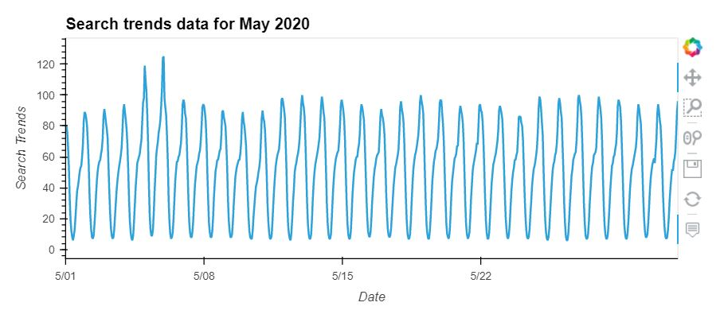
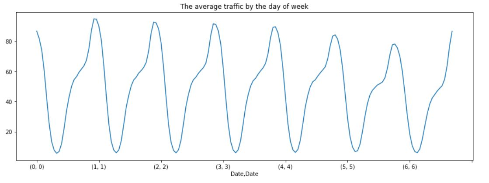
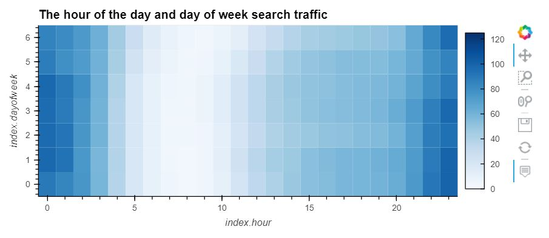

# Forecasting-MercadoLibre

This repository represents the researching if the ability to predict search traffic can translate into the ability to successfully trade the stock.

---

## Approach

Step 1: Find unusual patterns in hourly Google search traffic

Step 2: Mine the search traffic data for seasonality

Step 3: Relate the search traffic to stock price patterns

Step 4: Create a time series model with Prophet

Step 5: Forecast revenue by using time series models

---

## Technologies

This project leverages the following tools for financial analysis:

- [Conda](https://docs.conda.io/en/latest/) - source package management system and environment management system.

- [Pandas](https://pandas.pydata.org) - Python library that’s designed specifically for data analysis.

- [Google Colab](https://colab.research.google.com/) - For running and review Python-based programs.

- [Prophet](https://facebook.github.io/prophet/) - is a procedure for forecasting time series data (created by Facebook).

---

## Input data

`/Resources/google_hourly_search_trends.csv` - traffic info
`/Resources/mercado_daily_revenue.csv` - Mercado daily revenue
`/Resources/mercado_stock_price.csv` - Mercado stock price

---

## Running analisys

1. Open [Google Colab](https://colab.research.google.com/)
2. Install the required libraries

```
!pip install pystan
!pip install fbprophet
!pip install hvplot
!pip install holoviews
```

3. Import the required libraries and dependencies

```
import pandas as pd
import holoviews as hv
from fbprophet import Prophet
import hvplot.pandas
import datetime as dt
%matplotlib inline
```

4. Run code (Note. during running code user has to upload input files)

---

## Find Unusual Patterns in Hourly Google Search Traffic



```
Traffic_may_2020 value is 38181
Median_monthly_traffic value is 35172.5
```

Comparing traffic in May and the median for the entire period, we can say that traffic in May increased.

## Mine the Search Traffic Data for Seasonality





I can say that Saturday afternoon traffic is somewhat lower than other days. This is especially pronounced from 8 am to 7 pm. Apparently it's because it's a holiday.


