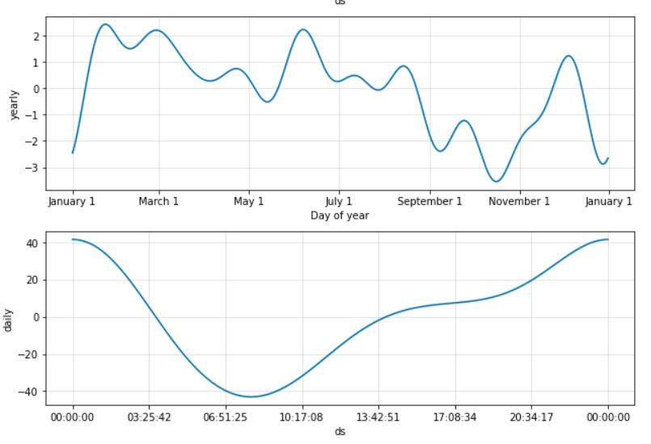

# Forecasting-MercadoLibre

This repository represents the researching if the ability to predict search traffic can translate into the ability to successfully trade the stock.

---

## Approach

Step 1: Find unusual patterns in hourly Google search traffic

Step 2: Mine the search traffic data for seasonality

Step 3: Relate the search traffic to stock price patterns

Step 4: Create a time series model with Prophet

Step 5: Forecast revenue by using time series models

---

## Technologies

This project leverages the following tools for financial analysis:

- [Conda](https://docs.conda.io/en/latest/) - source package management system and environment management system.

- [Pandas](https://pandas.pydata.org) - Python library that’s designed specifically for data analysis.

- [Google Colab](https://colab.research.google.com/) - For running and review Python-based programs.

- [Prophet](https://facebook.github.io/prophet/) - is a procedure for forecasting time series data (created by Facebook).

---

## Input data

`/Resources/google_hourly_search_trends.csv` - traffic info

`/Resources/mercado_daily_revenue.csv` - Mercado daily revenue

`/Resources/mercado_stock_price.csv` - Mercado stock price

---

## Running analisys

1. Open [Google Colab](https://colab.research.google.com/)
2. Install the required libraries

```
!pip install pystan
!pip install fbprophet
!pip install hvplot
!pip install holoviews
```

3. Import the required libraries and dependencies

```
import pandas as pd
import holoviews as hv
from fbprophet import Prophet
import hvplot.pandas
import datetime as dt
%matplotlib inline
```

4. Run code (Note. during running code user has to upload input files)

---

## Find Unusual Patterns in Hourly Google Search Traffic


```
Traffic_may_2020 value is 38181
Median_monthly_traffic value is 35172.5
```

Comparing traffic in May and the median for the entire period, we can say that traffic in May increased.

## Mine the Search Traffic Data for Seasonality


I can say that Saturday afternoon traffic is somewhat lower than other days. This is especially pronounced from 8 am to 7 pm. Apparently it's because it's a holiday.


From weeks 40 to 42, the trend, on the contrary, was in decline, but from week 43, the trend took approximately the same level until week 52. Only slightly increasing in moments.

## Relate the Search Traffic to Stock Price Patterns


Based on the information on the charts, we can say that there is a dependence of the closing price on the intensity of search traffic. If the search has decreased, then the price also decreases.


There is no the relationsheep between the lagged search traffic and the stock volatility because correlation has the negative value -0.220319. Also there is no the relationsheep between the lagged search traffic and hourly stock return due the negative correlation value -0.005230

## Create a Time Series Model with Prophet


According to the chart, it can be assumed that the forecast in the first half will not be very encouraging, as the trend will move down, but starting from the middle, the trend will change its direction in a positive direction.




Some conclusions:
The greatest popularirity is increasing from 8-00 till the 24-00.
The most search traffic on Tuesday.
The middle of October is the lowest point for search traffic in the calendar year.

## Forecast Revenue by Using Time Series Models (optional)


Wednesday is the peak revenue day. After the Wednesday the revenue goes down till the Saturday.


"forecast_quarter" DataFrame (5 last rows):


Summed values for all the rows in the "forecast_quarter" DataFrame:

```
Best case      2116.734490
Worst case     1772.766584
Most likely    1945.383691
```

Based on the forecast for the next quarter, the most likely profit is 1945.383691. With ideal sales, the profit will be 2116.734490. In the worst scenario, the profit will be 1772.766584.

---

## Contributors

Vladislav Glupak - [Linkedin](https://www.linkedin.com/in/vladislav-glupak/)

---

## License

It is an Open-source analysis.
